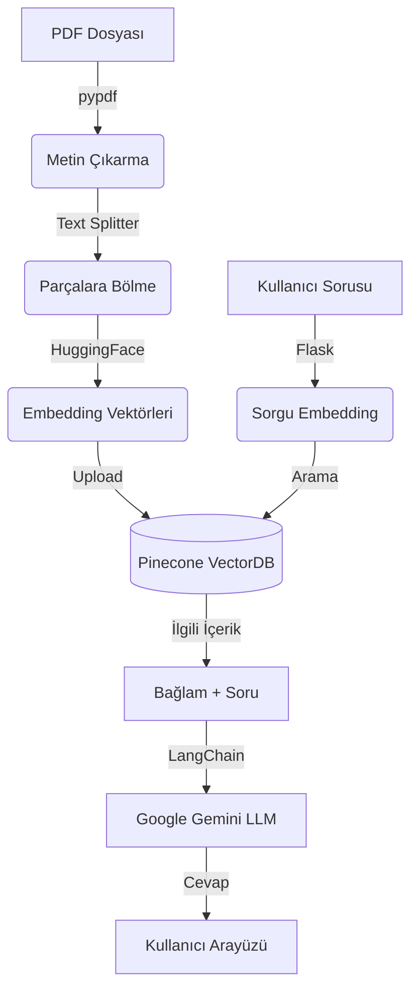

# :speech_balloon: Medical-Chatbot
ITU MTH409: AI Chatbot Course Term Assignment. 
Bu proje, "The Gale Encyclopedia of Medicine" kitap pdf dosyasi kullanilarak medikal asistan olan bir chatbot uretmeyi amaclamistir.
### :pill: Medikal Asistan
Asistanımız hastalık isimleri sorulduğunda kullanıcıyı bilgilendirir, tedavileri ve belirtileri hakkında soruları yanıtlar.

---

## 🏗️ Proje Mimarisi ve Çalışma Mantığı

Proje, verilerin işlenmesi (Ingestion) ve kullanıcının soru sorması (Inference) olmak üzere iki ana aşamadan oluşur. Tüm bu süreçlerin yönetiminde **LangChain** orkestrasyon framework'ü kullanılmıştır.

### 1. Veri Hazırlığı ve İndeksleme (Data Ingestion)
Chatbot'un verileri tanıması için yapılan ön hazırlık aşamasıdır:

1.  **Veri Yükleme (Document Loading):** `pypdf` kütüphanesi kullanılarak PDF dosyaları okunur ve metne dönüştürülür.
2.  **Metin Bölümleme (Text Splitting):** LLM token limitlerine takılmamak ve anlam bütünlüğünü korumak için metinler `RecursiveCharacterTextSplitter` ile 1000 karakterlik küçük parçalara (chunks) ayrılır.
3.  **Vektörleştirme (Embedding):** Her bir metin parçası, **Hugging Face** üzerinden `sentence-transformers/all-MiniLM-L6-v2` modeli kullanılarak sayısal vektörlere dönüştürülür.
4.  **Vektör Veritabanı (Vector Store):** Oluşturulan bu vektörler, hızlı anlamsal arama yapılabilmesi için **Pinecone** bulut veritabanına kaydedilir.

### 2. Soru-Cevap Akışı (Chat Pipeline)
Kullanıcı arayüz üzerinden bir soru sorduğunda arka planda şu işlemler gerçekleşir:

1.  **Kullanıcı Arayüzü:** Kullanıcı, **Flask** ile hazırlanan web arayüzünden sorusunu gönderir.
2.  **Anlamsal Arama:** Kullanıcının sorusu vektöre çevrilir ve **Pinecone** üzerinde "bu soruya en çok benzeyen doküman parçaları" aranır (Similarity Search).
3.  **Prompt Oluşturma:** Bulunan ilgili metin parçaları ve kullanıcının sorusu birleştirilerek **LangChain** aracılığıyla bir prompt (istem) haline getirilir.
4.  **Yanıt Üretme (LLM):** Hazırlanan prompt, **Google Gemini 2.5 Flash** modeline gönderilir. Gemini, sadece kendisine sunulan bağlamı (context) kullanarak soruyu cevaplar.
5.  **Sonuç:** Üretilen cevap Flask arayüzünde kullanıcıya gösterilir.

---

## 🛠️ Kullanılan Teknolojiler

Bu projenin hayata geçirilmesinde aşağıdaki modern AI teknolojileri kullanılmıştır:

| Teknoloji | Görevi | Neden Seçildi? |
|-----------|--------|----------------|
| **LangChain** | **Omurga** | Tüm bileşenleri (LLM, VectorDB, Prompt) birbirine bağlayan ana iskeleti oluşturur. |
| **Google Gemini** | **LLM (Zeka)** | Hızlı yanıt süresi ve yüksek bağlam kapasitesi için tercih edildi. |
| **Groq Llama 3** | **LLM (Zeka)** | Hızlı oluşu ve açık kaynak olması, kolay entegre edilebilirliği sebebiyle tercih edildi. |
| **Pinecone** | **Vector Database** | Vektör verilerini bulutta saklamak ve milisaniyeler içinde arama yapmak için kullanıldı. |
| **Hugging Face** | **Embeddings** | Metinleri anlamlı sayısal verilere dönüştürmek için açık kaynaklı modeller sağlar. |
| **Flask** | **Backend / API** | Python tabanlı hafif bir web sunucusu oluşturmak ve frontend ile iletişimi sağlamak için. |
| **PyPDF** | **PDF Loader** | Doküman içerisindeki metinleri ham formatta ayıklamak için. |



---

## :bulb: Seçilen LLM Modelleri

### Google Gemini (2.5-flash-lite) <br>
    Sektörün GPT ile birlikte önde gelen modellerinden biri ve ücretsiz API key oluşturulabilmesi sebebiyle ilk tercihim oldu.
### Groq (Llama 3.1 8B) <br>
    Gemini ile karşılaştırma yapabileceğim (OpenAI dışı) bir model olarak, hızlı olması, Gemini'a kıyasla açık kaynak olması ve kurulum kolaylığı açısından Groq-Llama3 modelini tercih ettim. Bir de ücretsiz API key oluşturulup kullanilabilmesinden dolayı :smiley: .

---

## :bar_chart: Model Karşılaştırma

Veri seti olarak PDF dosyası kullanıldığından dolayı bu projede iki LLM modelini kıyaslamak adına RAGAS (RAG Assessment) kütüphanesi kullanıldı. RAGAS Framework kullanılarak iki model için de Evaluation yapılarak csv dosyalarında sonuçlar tutuldu.<br>
RAGAS jurisi için Gemini LLM modeli kullanıldı. <br>
RAGAS Metriklerimiz: Faithfulness ve Answer Relevancy.<br>
5 Soruluk bir test verisi kullanıldı ve evaluation işlemi gerçekleştirildi.

### Örnek test soruları ve cevapları
1. "What are the primary symptoms of Asthma?"
    cevap: "Asthma symptoms include wheezing, shortness of breath, chest tightness, and coughing."
2.  "What defines Hypertension (High Blood Pressure)?"
    cevap:  "Hypertension is defined as having a blood pressure reading consistently at or above 140/90 mmHg."
3.  "What are the common causes of Iron Deficiency Anemia?"
    cevap: "Iron deficiency anemia is caused by a lack of iron in the body due to blood loss or poor diet."
4.  "How is Type 2 Diabetes primarily characterized?"
    cevap: "Type 2 diabetes is characterized by insulin resistance and high blood sugar levels."
5.  "What are the early warning signs of Alzheimer's Disease?"
    cevap:  "Early signs of Alzheimer's include memory loss, confusion with time or place, and trouble finding words."

| Model    | Faithfulness | Answer_relevancy |
|----------|-----------|--------|
| Gemini   | 1     | 0.886|
| Llama3   | 0.871 | 0.918   |

---

##  :wrench: Local'de Uygulamayı Ayağa Kaldırma

İki farklı LLM modeli kullanıldığından, iki farklı Python sanal environment oluşturularak ayrı ortamlarda yürütülmüştür. Bunun nedeni model değişikliği beraberinde gelen farklı langchain paketlerinde versiyon çatışması yaşanması ihtimaline karşın temiz bir çalışma ortaya çıkması amaçlanmasıdır.
Langchain paketlerinin sıklıkla güncellenen yapıları sebebiyle import etme zorlukları ve versiyon çatışmaları sıklıkla karşımıza çıkıyor.

### Projeleri Çalıştırma
Uygulamalari bir API üzerinden web sayfasında ayağa kaldırmak için Flask kullanıldı.
İki model için ayrı app dosyaları oluşturulmuştur ve lokalimizde uygun environment aktive edildikten sonra ilgili app dosyası çalıştırılarak lokalden chatbota bağlantı sağlanabilmektedir.
<br>
a. Gemini Modeli <br>
```
conda activate medibot
```
```python
python app.py
```
b. Groq LLama3 Modeli <br>
```
conda activate medibot_gq
```
```python
python app_gq.py
```
---

## Arayüz

<p align="center">
  
</p>


