# :speech_balloon: Medical-Chatbot
ITU MTH409: AI Chatbot Course Term Assignment. 
Bu proje, "The Gale Encyclopedia of Medicine" kitap pdf dosyası kullanılarak medikal asistan olan bir chatbot üretmeyi amaçlamıştır.
### :pill: Medikal Asistan
Asistanımız hastalık isimleri sorulduğunda kullanıcıyı bilgilendirir, tedavileri ve belirtileri hakkında soruları yanıtlar.

---

## 🏗️ Proje Mimarisi ve Çalışma Mantığı

Proje, verilerin işlenmesi (Ingestion) ve kullanıcının soru sorması (Inference) olmak üzere iki ana aşamadan oluşur. Tüm bu süreçlerin yönetiminde **LangChain** framework'ü kullanılmıştır.

### 1. Veri Hazırlığı ve İndeksleme (Data Ingestion)
Chatbot'un verileri tanıması için yapılan ön hazırlık aşamasıdır:

1.  **Veri Yükleme (Document Loading):** `pypdf` kütüphanesi kullanılarak PDF dosyaları okunur ve metne dönüştürülür.
2.  **Metin Bölümleme (Text Splitting):** LLM token limitlerine takılmamak ve anlam bütünlüğünü korumak için metinler `RecursiveCharacterTextSplitter` ile 1000 karakterlik küçük parçalara (chunks) ayrılır.
3.  **Vektörleştirme (Embedding):** Her bir metin parçası, **Hugging Face** üzerinden `sentence-transformers/all-MiniLM-L6-v2` modeli kullanılarak sayısal vektörlere dönüştürülür.
4.  **Vektör Veritabanı (Vector Store):** Oluşturulan bu vektörler, hızlı anlamsal arama yapılabilmesi için **Pinecone** bulut veritabanına kaydedilir.

### 2. Soru-Cevap Akışı (Chat Pipeline)
Kullanıcı arayüz üzerinden bir soru sorduğunda arka planda şu işlemler gerçekleşir:

1.  **Kullanıcı Arayüzü:** Kullanıcı, **Flask** ile hazırlanan web arayüzünden sorusunu gönderir.
2.  **Anlamsal Arama:** Kullanıcının sorusu vektöre çevrilir ve **Pinecone** üzerinde "bu soruya en çok benzeyen doküman parçaları" aranır (Similarity Search).
3.  **Prompt Oluşturma:** Bulunan ilgili metin parçaları ve kullanıcının sorusu birleştirilerek **LangChain** aracılığıyla bir prompt (istem) haline getirilir.
4.  **Yanıt Üretme (LLM):** Hazırlanan prompt, **Google Gemini 2.5 Flash** modeline gönderilir. Gemini, sadece kendisine sunulan bağlamı (context) kullanarak soruyu cevaplar.
5.  **Sonuç:** Üretilen cevap Flask arayüzünde kullanıcıya gösterilir.

---

## 🛠️ Kullanılan Araçlar

Bu projenin hayata geçirilmesinde aşağıdaki modern AI teknolojileri kullanılmıştır:

| Araç | Görevi | Neden Seçildi? |
|-----------|--------|----------------|
| **LangChain** | **Omurga** | Tüm bileşenleri (LLM, VectorDB, Prompt) birbirine bağlayan ana iskeleti oluşturur. |
| **Google Gemini** | **LLM (Zeka)** | Hızlı yanıt süresi ve yüksek bağlam kapasitesi için tercih edildi. |
| **Groq Llama 3** | **LLM (Zeka)** | Hızlı oluşu ve açık kaynak olması, kolay entegre edilebilirliği sebebiyle tercih edildi. |
| **Pinecone** | **Vector Database** | Vektör verilerini bulutta saklamak ve milisaniyeler içinde arama yapmak için kullanıldı. |
| **Hugging Face** | **Embeddings** | Metinleri anlamlı sayısal verilere dönüştürmek için açık kaynaklı modeller sağlar. |
| **Flask** | **Backend / API** | Python tabanlı hafif bir web sunucusu oluşturmak ve frontend ile iletişimi sağlamak için. |
| **PyPDF** | **PDF Loader** | Doküman içerisindeki metinleri ham formatta ayıklamak için. |

```mermaid
graph TD
    A[PDF Dosyası] -->|pypdf| B(Metin Çıkarma)
    B -->|Text Splitter| C(Parçalara Bölme)
    C -->|HuggingFace| D(Embedding Vektörleri)
    D -->|Upload| E[(Pinecone VectorDB)]
    
    F[Kullanıcı Sorusu] -->|Flask| G(Sorgu Embedding)
    G -->|Arama| E
    E -->|İlgili İçerik| H[Bağlam + Soru]
    H -->|LangChain| I[Google Gemini LLM]
    I -->|Cevap| J[Kullanıcı Arayüzü]
```



---

## :bulb: Seçilen LLM Modelleri

### Google Gemini (2.5-flash-lite)
Sektörün GPT ile birlikte önde gelen modellerinden biri ve ücretsiz API key oluşturulabilmesi sebebiyle ilk tercihim oldu.
### Groq (Llama 3.1 8B)
Gemini ile karşılaştırma yapabileceğim (OpenAI dışı) bir model olarak, hızlı olması, Gemini'a kıyasla açık kaynak olması ve kurulum kolaylığı açısından Groq-Llama3 modelini tercih ettim. Bir de ücretsiz API key oluşturulup kullanilabilmesinden dolayı :smiley: .

---

## :bar_chart: Model Karşılaştırma

Veri seti olarak PDF dosyası kullanıldığından dolayı bu projede iki LLM modelini kıyaslamak adına RAGAS (RAG Assessment) kütüphanesi kullanıldı. RAGAS Framework kullanılarak iki model için de Evaluation yapılarak csv dosyalarında sonuçlar tutuldu.<br>
RAGAS jurisi için Gemini LLM modeli kullanıldı. <br>
RAGAS Metriklerimiz: Faithfulness ve Answer Relevancy.<br>
5 Soruluk bir test verisi kullanıldı ve evaluation işlemi gerçekleştirildi.

### Örnek test soruları ve cevapları
1. "What are the primary symptoms of Asthma?"
    `cevap:` "Asthma symptoms include wheezing, shortness of breath, chest tightness, and coughing."
2.  "What defines Hypertension (High Blood Pressure)?"
    `cevap:`  "Hypertension is defined as having a blood pressure reading consistently at or above 140/90 mmHg."
3.  "What are the common causes of Iron Deficiency Anemia?"
    `cevap:` "Iron deficiency anemia is caused by a lack of iron in the body due to blood loss or poor diet."
4.  "How is Type 2 Diabetes primarily characterized?"
    `cevap:` "Type 2 diabetes is characterized by insulin resistance and high blood sugar levels."
5.  "What are the early warning signs of Alzheimer's Disease?"
   `cevap:`  "Early signs of Alzheimer's include memory loss, confusion with time or place, and trouble finding words."

| Model    | Faithfulness | Answer_relevancy |
|----------|-----------|--------|
| Gemini   | 1     | 0.886|
| Llama3   | 0.871 | 0.918   |

---

## :key: Gerekli API Key'ler

- **Pinecone API Key** <br>
    Pinecone vektör veritabanımız için. 
- **Google API Key** <br>
    Gemini modeli olan chatbotumuz için.
- **Groq API Key** <br>
    LLama modeli olan chatbotumuz için.
- **Google API Key (RAGAS)** <br>
    İki modelimiz için ayrı API Key'ler ile jüri oluşturduk.<br>


### .env Dosyanızın İçeriği
```
PINECONE_API_KEY="your_api_key"
GOOGLE_API_KEY="your_api_key"
GROQ_API_KEY="your_api_key"
#yine Google API Key:
RAGAS_JUDGE_API_KEY="your_api_key"
RAGAS_JUDGE_GQ_API_KEY="your_api_key"
```

<mark> Not: Burada Google AI studio ücretsiz sürümden faydalanıldığı için RAGAS Evaluation jüri oluşturma işlemi esnasında kullanım sınırlarının aşılmaması adına farklı API Key'ler kullanılmıştır. </mark>

---

##  :wrench: Local'de Uygulamayı Ayağa Kaldırma

İki farklı LLM modeli kullanıldığından, iki farklı Python sanal environment oluşturularak ayrı ortamlarda yürütülmüştür. Bunun nedeni model değişikliği beraberinde gelen farklı langchain paketlerinde versiyon çatışması yaşanması ihtimaline karşın temiz bir çalışma ortaya çıkması amaçlanmasıdır.
Langchain paketlerinin sıklıkla güncellenen yapıları sebebiyle import etme zorlukları ve versiyon çatışmaları sıklıkla karşımıza çıkıyor.


### Projeleri Çalıştırma
Uygulamalari bir API üzerinden web sayfasında ayağa kaldırmak için Flask kullanıldı.
İki model için ayrı app dosyaları oluşturulmuştur ve lokalimizde uygun environment aktive edildikten sonra ilgili app dosyası çalıştırılarak lokalden chatbota bağlantı sağlanabilmektedir.
<br>
a. Gemini Modeli <br>
```
conda activate medibot
```
```python
python app.py
```
b. Groq LLama3 Modeli <br>
```
conda activate medibot_gq
```
```python
python app_gq.py
```
---

## Arayüz

<p align="center">
  
</p>

---

## Proje Çıktıları, Dikkat Edilmesi Gereken Unsurlar ve Yorumlar

### Paket versiyon çakışmaları
Langchain kullanımında paket yapısı güncellenebilme durumu olduğundan "pip install" komutunu ortamınızda çalıştırıp yeni bir paket yüklediğinizde versiyon çatışmaları sebebiyle projeniz çalışmayabilir. Oldukça fazla kez karşıma çıkan bir problem oldu. <br>
İki LLM modeli için ayrı sanal ortamlar kurarak gerekli paketleri indirdim ve daha temiz ve garanti bir çalışma şekli elde edebildim.<br>
Langchain dokümantasyon sayfalarından güncel olarak paketi import etmek için hangi komut gerektiğini sıklıkla kontrol etmem gerekti.

### API Key Free Trial Usage Limit
Eğer LLM kullanımlarında ücretsiz sürümlerden yararlanıyorsanız, uzun bir süre modeli deneyerek çalışmanızı yürütürseniz belirli bir zaman içerisindeki istek sınırına ulaşmanız olasıdır.<br>
Bu projede ücretsiz bir şekilde Google AI Studio ve Groq LLM Inference kullanarak API Key'ler oluşturuldu.<br>
Ancak yukarıda daha önce de belirtildiği gibi Google AI Studio'da proje başına olan kullanım limitini özellikle RAGAS işlemini yaparken aşmanız çok olasıdır, bu nedenle ayrı projeler ile farklı API Key'ler oluşturmanızı öneririm.

### Veri Seti Yetersizliği
Projeye geliştirme önerisi ve eleştiri olarak daha kapsamlı bir veri setiyle çalışabildiği takdirde daha esnek ve verimli bir chatbot geliştirilebiliceğini düşünüyorum.<br>
Bazı sohbetlerde "similarity search" yanlış çalışabiliyor ve chatbotun kullanıcıyı yanlış anladığı ve yanlış bağlamı getirdiği durumlar oluşabildiğini gözlemledim.<br>
Bununla beraber son olarak PDF'imizde Latince Tıbbi rahatsızlık isimleri geçmesi ve kaynağın İngilizce olması kullanıcının başka dillerde bir sorgu oluşturduğunda chatbotun anlamlı cevap verememesine sebebiyet verebildiğini gözlemledim.

### Özet
Bu projenin AI Chatbot yapımının temellerini kavramak ve konseptlere giriş yapmak için verimli bir başlangıç olduğunu düşünüyorum.<br>
Basic bir RAG projesiyle nasıl chatbot yapılabileceğiyle ilgili pratik yapabileceğiniz, temelde basit gibi olsa da tüm projeyi inşaa ederken minik detaylarla zorlanarak daha çok bilgilenebileceğiniz bir deneyim sunuyor.


